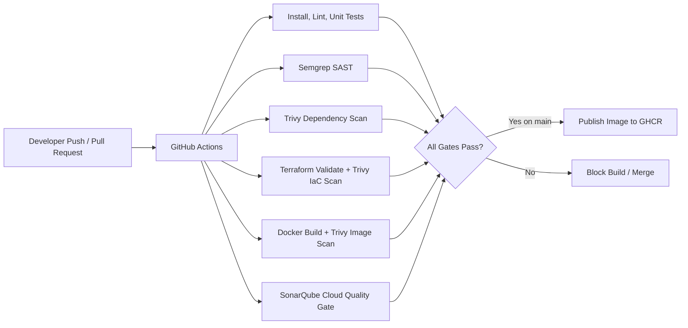

# DevSecOps CI/CD Pipeline Demo

College-ready project showing an end-to-end CI/CD pipeline with automated security gates. The pipeline checks application code, dependencies, Terraform/IaC, and Docker images on pushes to the protected demo branches and on pull requests. Unsafe builds fail before the container image is published.

## What This Project Demonstrates

For a simple setup guide, start with [docs/setup/START_HERE.md](docs/setup/START_HERE.md).



## Stack

- Node.js 24 LTS and Express for the demo API.
- Docker and Docker Compose for local container runs.
- GitHub Actions for CI/CD automation.
- Semgrep Community Edition for SAST.
- Trivy for dependency, image, and Terraform/IaC scanning.
- Terraform CLI for IaC formatting, validation, and speculative plan.
- SonarQube Cloud for CI code quality gates.
- Optional local SonarQube Community Build dashboard with Docker Compose.

## API

```text
GET /health
GET /api/status
```

Run locally:

```powershell
npm ci
npm run lint
npm test
npm start
```

Then open:

```text
http://localhost:3000/health
http://localhost:3000/api/status
```

## Docker

```powershell
docker build -t devsecops-ci-pipeline-demo:local .
docker run --rm -p 3000:3000 devsecops-ci-pipeline-demo:local
```

Or:

```powershell
docker compose up --build
```

## Local Security Verification

Run the full local verification script:

```powershell
.\scripts\verify-local.ps1
```

Manual commands:

```powershell
semgrep scan --config auto --error .
trivy fs --config trivy.yaml --no-progress .
docker build -t devsecops-ci-pipeline-demo:local .
trivy image --ignore-unfixed --severity HIGH,CRITICAL --exit-code 1 --no-progress devsecops-ci-pipeline-demo:local
terraform -chdir=infra fmt -check -recursive
terraform -chdir=infra init -backend=false
terraform -chdir=infra validate
Remove-Item -LiteralPath "infra\tfplan" -Force -ErrorAction SilentlyContinue
trivy config --severity HIGH,CRITICAL --exit-code 1 infra/
terraform -chdir=infra plan -no-color -out=tfplan
Remove-Item -LiteralPath "infra\tfplan" -Force -ErrorAction SilentlyContinue
```

## SonarQube Cloud Setup

Create a free SonarQube Cloud project for the public GitHub repository.

Add these GitHub repository settings:

- Secret: `SONAR_TOKEN` from SonarQube Cloud `My Account` > `Security` > `Generate Tokens`.
- Variable: `SONAR_ORGANIZATION=<your SonarQube Cloud organization key>`
- Variable: `SONAR_PROJECT_KEY=<your SonarQube Cloud project key>`
- Optional variable: `SONAR_BRANCH_NAME=<SonarQube Cloud main branch name, only if different>`

The workflow fails with a clear error if these are missing. This is intentional because the project requires an automated code quality gate.

## Optional Local SonarQube Community Build

Start local SonarQube:

```powershell
.\scripts\start-sonarqube.ps1
```

Open:

```text
http://localhost:9000
```

Local scanner example after creating a local project token:

```powershell
sonar-scanner -Dsonar.host.url=http://localhost:9000 -Dsonar.token=<local-token> -Dsonar.projectKey=devsecops-ci-pipeline-demo
```

## GitHub Actions Behavior

The workflow runs on:

- push to `main`
- push to `demo/**`
- pull request to `main`
- manual workflow dispatch

Blocking gates:

- lint and unit tests
- Semgrep SAST
- Trivy filesystem/dependency scan
- Terraform format, validate, and speculative plan
- Trivy Terraform/IaC scan
- Docker image build and Trivy image scan
- SonarQube Cloud quality gate

Only `main` publishes to GitHub Container Registry after every gate passes:

```text
ghcr.io/<owner>/<repo>:<git-sha>
ghcr.io/<owner>/<repo>:latest
```

## Demo Failure Branch

The clean `main` branch is designed to pass. A separate branch named `demo/failing-security-gates` is used to show unsafe builds being blocked. Open a pull request from that same repository branch into `main` and capture the failed checks for the college report. Same-repository demo branches are recommended because SonarQube Cloud needs the repository secret during CI.

## Security Note on the Runtime Image

The Dockerfile removes npm from the final runtime image after installing production dependencies in a separate build stage. The app only needs the Node runtime in production, and this keeps image scanning focused on deployable runtime components instead of unused package-manager internals.

## Viva Explanation

This project is a DevSecOps pipeline, not just a web app. The Express API is intentionally small so the focus stays on CI/CD automation. Code pushed through the configured GitHub workflow goes through automated gates. If a serious issue appears in the source code, dependency tree, Terraform files, or Docker image, the pipeline fails and the image is not published. That demonstrates the core requirement: unsafe builds are automatically blocked.
